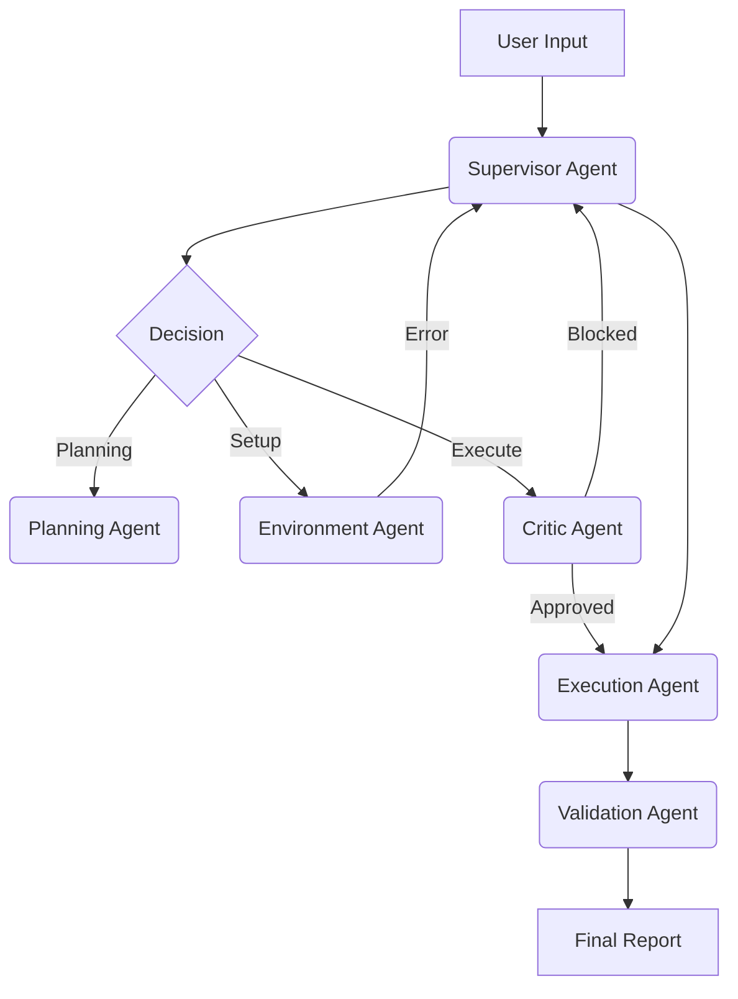

# 📄 Paper Reproduction Agent


**An Autonomous AI Agent that reads research papers, clones their code, and scientifically verifies their results.**

> [!NOTE]
> This is not a "Chat with PDF" tool. It is a **State Machine** that manages environments, debugs code, and detects hardware to reproduce verifiable scientific baselines.

---

## 🚀 Key Features (Why this matters)

*   **🧠 Unified Agent Architecture**: Orchestrates specialized agents (Analyzer, Setup, Reproducer) using a LangGraph state machine.
*   **🛡️ Self-Healing Environment**: Automatically detects broken dependencies (e.g., `numpy` version conflicts) and fixes them without human intervention.
*   **💻 Resource Awareness**: Detects available hardware (e.g., "4x NVIDIA L40S") and dynamically adjusts batch sizes and training strategies to prevent OOM errors.
*   **🔬 Scientific Verification**: Parses the PDF to find the "Gold Standard" result table and writes python code to compare reproduced metrics against claims ($\pm$ 5% margin).

---

## 🏗️ Architecture: Supervisor Multi-Agent System



**Core Components:**
*   **Supervisor Agent** (`src/agents/supervisor_agent.py`): The brain of the system. Uses hierarchical context to route tasks and handle failures cyclically.
*   **Orchestrator** (`src/orchestrator.py`): Manages the state graph (LangGraph) and passes control between agents.
*   **Critic Agent**: Intercepts potentially dangerous actions (e.g., file deletion) before execution.

---

## ⚡ Quick Start

### 1. Installation
```bash
git clone https://github.com/Nadav22799/paper_reproduction_agent.git
cd paper_reproduction_agent
pip install -e .
```

### 2. Reproduce a Paper
```bash
# Reproduce a paper by arXiv ID
python src/cli.py reproduce 2310.12345

# Reproduce from a local PDF
python src/cli.py reproduce ./downloads/my_paper.pdf
```

### 3. Verify System Health
```bash
python src/cli.py verify
```

---

## 📊 Benchmarks

We rigorously test this agent against a "Challenge Dataset" of papers known for reproducibility issues.

| Paper ID | Domain | Challenge | Status | Variance |
| :--- | :--- | :--- | :--- | :--- |
| **[2406.03386] NeuralWalker** | GNNs | Scale & OOM | ✅ Success | $\pm$ 0.0004 |
| **[1609.02907] GCN** | GNNs | Legacy Debt (2016) | ✅ Success | Matched (1/1) |
| **[1810.04805] BERT** | NLP | Code Rot (2018) | ⏳ Testing | - |

*See [BENCHMARK.md](BENCHMARK.md) for full scientific audit details.*

---

## 🛠️ Project Structure

*   `src/cli.py` - Main entry point (Click-based CLI).
*   `src/orchestrator.py` - LangGraph state machine definition.
*   `src/agents/` - specialized agent logic (Environment, Reproduction).
*   `src/tools/` - Sandbox-safe execution tools.
*   `.github/workflows` - CI/CD pipeline for automated testing.

---

## 🤝 Contributing

See [CONTRIBUTING.md](CONTRIBUTING.md) for guidelines.

## 📄 technical Details

For a deep dive into the code and agent logic, see [docs/INTERNAL_README.md](docs/INTERNAL_README.md).
