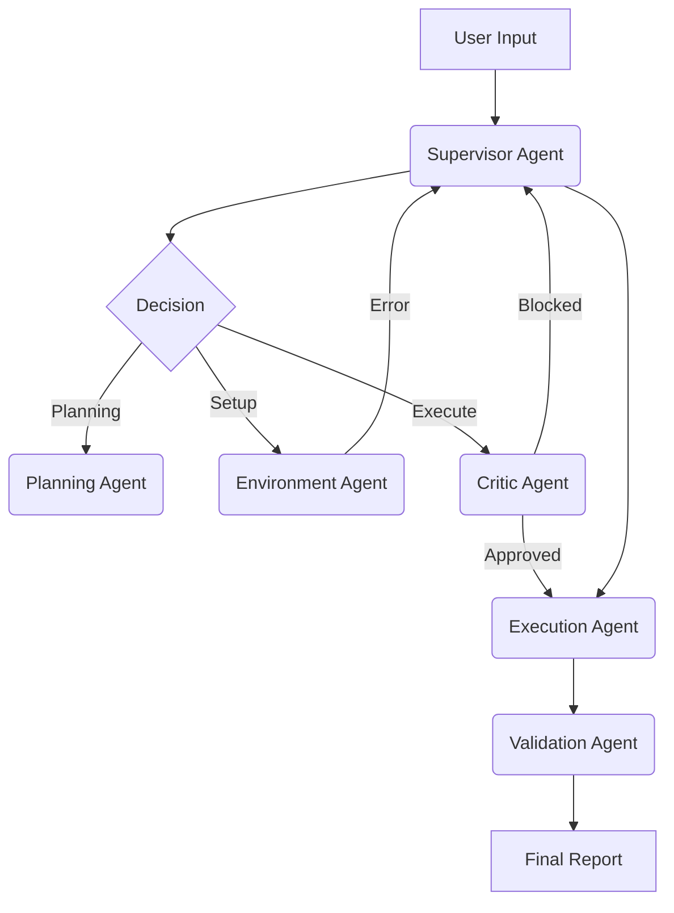

# 📄 Paper Reproduction Agent


**An autonomous multi-agent system that reads research papers, clones their code, sets up environments, and scientifically verifies their results.**

> [!NOTE]
> This is a stateful multi-agent system — not a document summarizer. It manages real environments, resolves dependencies, handles hardware detection, and verifies experimental results against paper-reported metrics.

---

## 🚀 Key Features

*   **Supervisor Multi-Agent Architecture**: Orchestrates specialized agents (Supervisor, Planning, Environment, Execution, Validation) via a LangGraph cyclic state machine.
*   **Self-Healing Environment**: Detects broken dependencies (e.g., `numpy` version conflicts, deprecated TensorFlow APIs) and resolves them autonomously.
*   **Resource Awareness**: Detects available hardware (e.g., "4x NVIDIA L40S" or laptop MX250) and adjusts batch sizes and training strategies to prevent OOM errors.
*   **Scientific Verification**: Extracts expected metrics from the paper PDF and compares reproduced results within a configurable tolerance (default $\pm$ 5%).

---

## 🏗️ Architecture



**Core Components:**
*   **Supervisor Agent** (`src/agents/supervisor_agent.py`): Routes tasks and handles failures cyclically — can route backwards (e.g., Execution → Environment Setup) to recover from errors.
*   **Orchestrator** (`src/orchestrator.py`): Manages the LangGraph state machine and passes control between agents.
*   **Critic Agent** (`src/agents/critic_agent.py`): Intercepts potentially dangerous actions (e.g., `rm -rf`, destructive `sed`) before execution.
*   **Planning Agent**: Analyzes the paper and repository to create a structured reproduction checklist.
*   **Environment / Execution / Validation Agents**: Handle setup, experiment execution, and result verification respectively.

### Architecture Highlights

**Cyclic Error Recovery** — Unlike linear pipelines, the Supervisor classifies errors semantically (environment, data, execution, validation) and routes back to the appropriate agent. A missing package triggers Environment Setup; a missing dataset triggers Data Prep.

**Hierarchical Context Memory** — A 3-tier memory system (Hot/Warm/Cold) prevents context window overflow during long runs. Relevant past context is retrieved using a multi-factor scoring formula:

```
Score = 0.4 × Semantic_Similarity + 0.3 × Recency + 0.2 × Importance + 0.1 × Source_Authority
```

**Safety Guardrails** — The Critic agent intercepts every Execution action and blocks potentially destructive operations, requiring the agent to justify its reasoning before proceeding.

---

## ⚡ Quick Start

### 1. Installation
```bash
git clone https://github.com/Nadav22799/paper_reproduction_agent.git
cd paper_reproduction_agent
pip install -e .
```

### 2. Reproduce a Paper
```bash
# Reproduce a paper by arXiv ID
python src/cli.py reproduce 1609.02907

# Reproduce from a local PDF
python src/cli.py reproduce ./downloads/my_paper.pdf
```

### 3. Verify System Health
```bash
python src/cli.py verify
```

---

## 📊 Benchmarks

| Paper | Domain | Challenge | Status | Key Result | Cost |
| :--- | :--- | :--- | :--- | :--- | :--- |
| **[1609.02907] GCN** | Graph Learning | Legacy Debt (TF 1.x, 2016) | ✅ Full | 6/7 metrics matched | $0.95 |
| **[1710.10903] GAT** | Graph Learning | CPU-only execution | ✅ Full | 82.7% (paper: 83.0 ± 0.7%) | $0.89 |
| **[2406.03386] NeuralWalker** | GNNs | Multi-GPU scale | ⚠️ Partial | ZINC: 0.0636 ± 0.0004 | — |

*See [BENCHMARK.md](BENCHMARK.md) for detailed results and analysis.*

---

## 🛠️ Project Structure

*   `src/cli.py` — Main entry point (Click-based CLI)
*   `src/orchestrator.py` — LangGraph state machine definition
*   `src/agents/` — Specialized agent logic (Supervisor, Planning, Environment, Execution, Validation, Critic)
*   `src/tools/` — Sandboxed execution and search tools
*   `src/utils/` — Hierarchical context, metrics tracking, resource detection
*   `.github/workflows/` — CI pipeline (lint + unit tests)

---

## 🤝 Contributing

See [CONTRIBUTING.md](CONTRIBUTING.md) for guidelines.

## 📄 Technical Details

For a deep dive into the architecture and agent internals, see [ARCHITECTURE.md](ARCHITECTURE.md).
